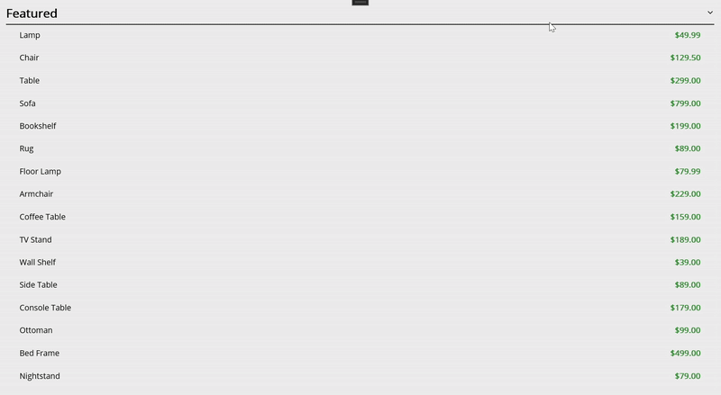
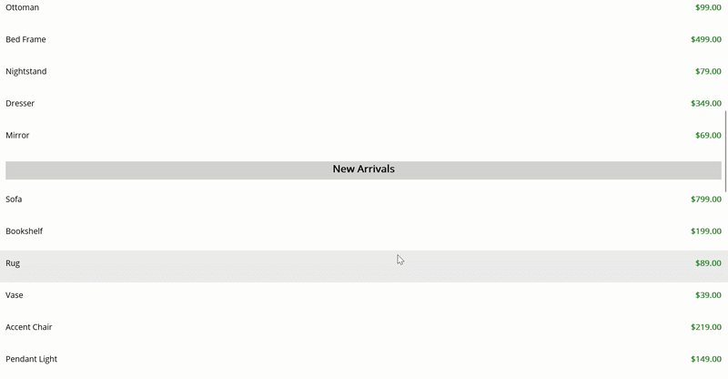
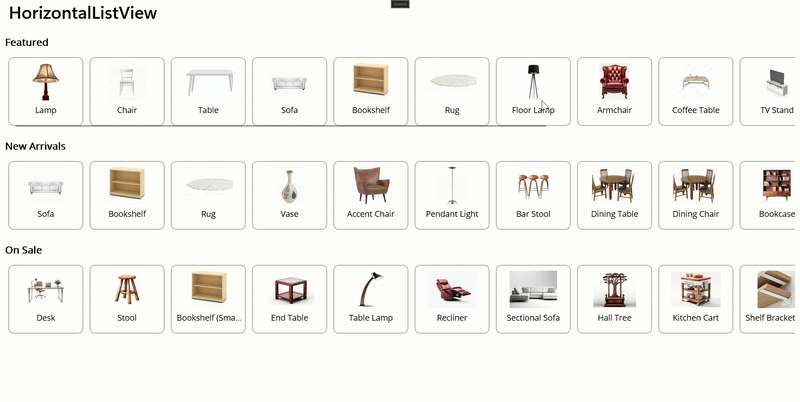
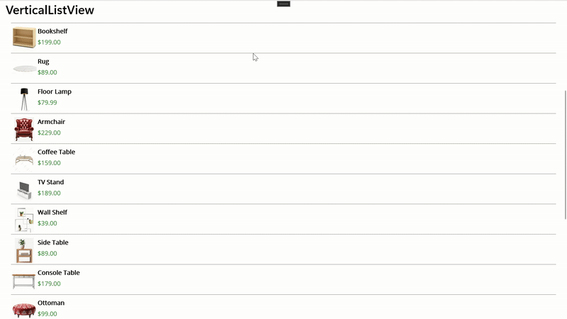

# Boost Your Apps By Avoiding Nested Lists In Syncfusion® .NET MAUI ListView

Syncfusion® .NET MAUI List View is ideal for virtualized, data-heavy UIs. Nesting one List View inside another, however, is a common anti-pattern that degrades performance. Nested List Views trigger extra measuring, compete for scroll gestures, and waste memory.

This sample explains why those issues occur, how to redesign with grouping, DataTemplateSelector and expand/collapse instead of nesting. It also provides practical guidance for managing unavoidable Nested List View scenarios in Syncfusion® .NET MAUI List View to maintain smooth and scalable scrolling performance.

## Why we need to Avoid Nested List View
1.	Nested List Views cause competing recyclers and extra measure/recycle work, which leads to stutter.
2.	Inner lists resizing during outer virtualization create re-entrant layouts that waste CPU and memory.
3.	Touch and scroll gestures compete between parent and child lists, causing unpredictable scrolling.
4.	Keyboard focus and accessibility navigation become confusing.
***

## Alternatives for Nested List View in Syncfusion® .NET MAUI ListView
### Grouping: 
Use a single List View and group items by a field such as category. Show a header for each group. You keep one scroll and smooth virtualization while users still see clear sections.

 

### Single List with Expand/Collapse: 
Use one list and let each parent row toggle its details in place. Tap to expand and tap again to collapse. Users stay in context without jumping into a nested list.
 
 

### Composite Item Template: 
For mixed row types Use a DataTemplateSelector to pick templates at runtime. Render posts, ads, dividers, or mini galleries in one List View. You retain one virtualization path and add new row types easily. 

## Syncfusion® .NET MAUI List View tuning tips
1.	ItemSize: Set a fixed size for uniform items to skip per-item measurement.
2.	QueryItemSize: Use when items vary in height to measure efficiently.
3.	Incremental loading: Load items on demand to keep memory and UI responsive.
4.	Template hygiene: Keep item templates lightweight. Size and cache images explicitly.
                                                    
## If Nested ListView Is Necessary: Best Practices
### Horizontal List View inside a Vertical List View: 
Add a lightweight horizontal strip (fixed height, non-virtualized) within a vertical feed. The outer list remains the only scroll owner.

### Vertical List View inside another Vertical List View: 
If required, disable inner scrolling by giving the inner list an exact height. Only the outer list should scroll. Keep inner templates light and item counts bounded.

## Syncfusion® .NET MAUI List View tuning tips

1.	ItemSize: Set a fixed size for uniform items to skip per-item measurement.
2.	QueryItemSize: Use when items vary in height to measure efficiently.
3.	Incremental loading: Load items on demand to keep memory and UI responsive.
4.	Template hygiene: Keep item templates lightweight. Size and cache images explicitly.

## Key Takeaways

1.	Do not stack a vertical list inside another vertical list that scrolls. Keep one scroller and flatten the data.
2.	Build with composition: use grouping, a DataTemplateSelector, expand/collapse, and lightweight horizontal scrollers.
3.	Tune Syncfusion® .NET MAUI List View for speed: set ItemSize (or use QueryItemSize), enable incremental loading, and keep images sized/cached.
4.	If you need a horizontal strip inside a vertical feed, fix its height and skip inner virtualization so only the outer list does the heavy lifting.

## Troubleshooting
### Path too long exception
If you are facing a path too long exception when building this example project, close Visual Studio and rename the repository to a shorter name before building the project.

For a step-by-step procedure, refer to the [AI-Powered Billionaire Wealth Dashboard Blog](https://www.syncfusion.com/blogs/post/ai-powered-winui-line-chart).